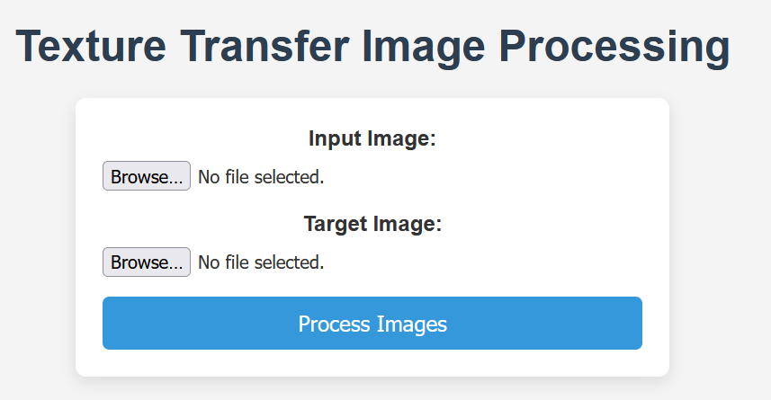
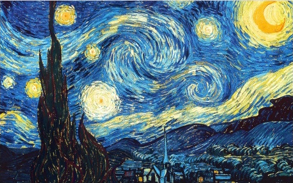
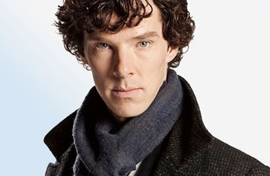
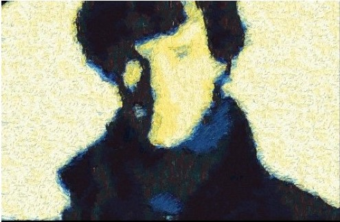

# Texture Transfer

This project was made as a part of **Digital Image Processing (ECN-316)** course under the guidance of **Dr. Vinod Pankajakshan** .It creates a way to transfer texture from one image onto the structure of another. It uses a method that combines picking small parts (patches) of texture and blending them smoothly to make the result look natural. The main steps include choosing texture patches, matching them to the target image, and blending the edges to avoid sharp lines. The method was tested on different images and gave good results. This can be used in photo editing and creating artistic effects. The project shows how texture manipulation can be made simple and useful for creative tasks. <br>
The detailed report of the project can be found [here](./DIP%20report.pdf).

## Setting up the project
### Clone the repo
```bash
git clone https://github.com/cy4n1d3-p1x3l/Texture-Transfer-DIP.git
```

### Installing dependencies 
```bash
pip install -r requirements.txt
```
```bash
cd dip-front
npm install
```

### Running the Project
```bash
cd dip-front
npm start
python3 ../dip-back/app.py
cd ..
```

### Select the Input image and Target image

*Select the Input image (texture image) and the Target image and press the process images button.* <br><br>


### Reference Output Images 
There are multiple settings to get the optimal and desired output with the overhead of excess time taken in processing the images over multiple iterations. <br>
These parameters can be changed [here](./dip-back/texture_transfer.py#L112) <br>
One set of output is given below and others can be found in the report. <br>

*Input texture*<br> 
 
<br><br>
*Target Image* <br>

<br><br>
*Output Image* <br>

<br><br>


## Team members

#### The following members made the following contributions in the project:
> **Mradul Singhal** (22116055) - Implemented the Texture Transfer algorithm along with the preparation of Report. <br>
> **Dhruv Goyal** (22112033) - Written and linked the frontend and backend, also wrote clear documentation.<br>
> **Jatin Gupta** (22116038) - Implemented the Texture Transfer algorithm along with helping in writing the documentation<br>
> **Abhishek Keshari** (22116003) - Research part of the project and contributed in report writing. <br>
